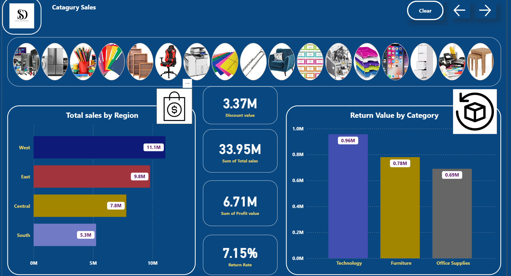
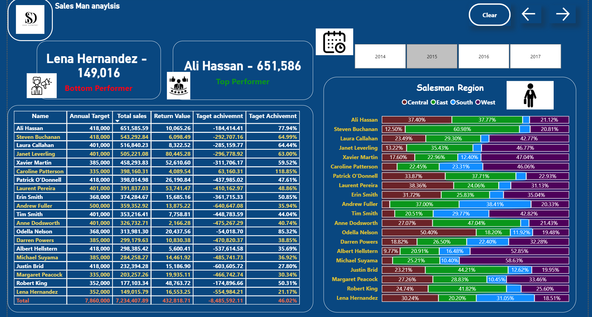
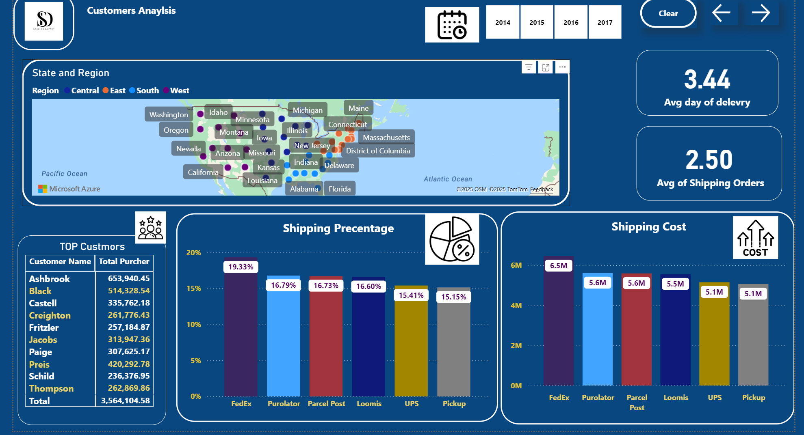
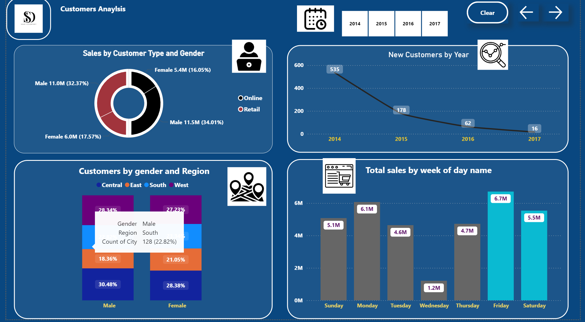

# 📊 Retail Sales & Operations Dashboard

## 🚀 Project Overview
This project is a comprehensive Business Intelligence solution built using **Microsoft Power BI**. It provides a 360-degree view of the company's performance, covering Sales, Employee Performance, Logistics, and Customer Demographics.

**Key Business Insights:**
* **Performance Tracking:** Monitoring sales targets and identifying top/bottom performing employees.
* **Logistics Efficiency:** Analyzing shipping costs, average delivery days, and carrier performance.
* **Customer Behavior:** Segmenting customers by gender, region, and purchasing trends over time.
* **Product Profitability:** Tracking return rates and profit margins across different categories.

---

## 🛠 Technical Skills & Tools Used

* **Data Transformation (ETL):** Used **Power Query** to clean data and merge multiple tables.
* **Data Modeling:** Built a Star Schema connecting Sales, Returns, People, and Region tables.
* **Advanced DAX:** Created measures for `Target Achievement %`, `Return Rate`, and `Time Intelligence` calculations.
* **UI/UX Design:** Designed a navigation bar with icons, clear/reset filters buttons, and interactive tooltips.

---

## 📸 Dashboard Screenshots

### 1. Product & Category Sales
> A visual breakdown of sales by category (Furniture, Technology, etc.), highlighting **Return Rates**, **Profit Values**, and discount impact.

### 2. Sales Team Performance
> Detailed evaluation of sales representatives against their **Annual Targets**. Includes dynamic ranking for Top & Bottom performers and regional contribution.

### 3. Logistics & Shipping Analysis
> Operational insights tracking **Average Delivery Days**, **Shipping Costs** by carrier (FedEx, UPS, etc.), and geographic distribution of orders.

### 4. Customer Demographics
> Deep-dive into customer segments based on **Gender** and **Region**, along with a trend line showing **New Customers by Year**.

---

## 📂 How to Run the Project
Since GitHub does not render `.pbix` files natively:

1. **Download** the project file: [**Click Here to Download .pbix File**](Sales%20Report.pbix)
2. Open the file using **Power BI Desktop**.
3. Use the navigation buttons (arrows) and slicers to interact with the report.

---
*Author: Saad AL Huqayl*
